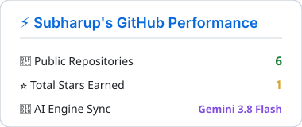
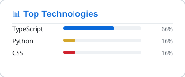

  <!-- Self-hosted, theme-adaptive vector banner -->
  

---

### 📊 Real-Time Performance & Metrics *(Locally Generated SVGs)*

  
  

---

<!-- AUTO-SUMMARY:START -->

### ⚡ Dynamic Technical Arsenal

| Area | Detected Technologies & Frameworks |
| :--- | :--- |
| **Languages** | TypeScript, Python, JavaScript (ES6+), HTML5, CSS3, SQL |
| **Frontend & UI** | Next.js (16+ App Router/Turbopack), React (19+), Vite 8, Tailwind CSS (v4), Framer Motion, Vanilla JS UI |
| **Backend & Systems** | Cloudflare Workers, Cloudflare D1 (SQLite), Prisma ORM, PostgreSQL (TCP Pool), Flask, SQLite3, REST APIs |
| **DevOps & Security** | Cloudflare Pages, Cloudflare Workers AI (Llama 3.1 8B), VULNEXUS XDR (SOC / Network Auditing), PulsePing Monitoring, Groq/Gemini Waterfall, Telegram/Discord Webhooks |

### 🚀 Automated Repository Digest

Subharup Biswas's engineering portfolio demonstrates a mature, multidisciplinary focus centered on edge-native serverless architectures, operational reliability, network systems, and cybersecurity tooling. Across projects, there is a recurring emphasis on modern web foundations—leveraging cutting-edge combinations like Next.js 16, React 19, and Tailwind CSS v4 alongside distributed edge primitives such as Cloudflare Workers and Cloudflare D1. The portfolio reflects an ability to design full-cycle platforms spanning real-time metric collection, asynchronous telemetry, and resilient failover chains.

Architecturally, the repositories showcase strong competencies in systems engineering and automated intelligence. Biswas balances low-overhead zero-build utilities with high-throughput applications that integrate LLM-based root-cause analysis, binary-stream network manipulation, and Extended Detection and Response (XDR) security systems. Consistent attention to performance benchmarking, edge caching, strict schema management, and production-grade documentation indicates an engineer adept at building reliable, cloud-resilient applications.

* **[PulsePing](https://github.com/SubharupBiswas/pulseping)**
  * Enterprise-grade operational monitoring and uptime-tracking SaaS running on Next.js 16, Prisma ORM, and pooled PostgreSQL.
  * Employs an intelligent multi-provider AI waterfall (Gemini → OmniRoute → Groq) to automate root-cause incident analysis without driving up API costs.
  * Provides zero-downtime public status dashboards, background heartbeat monitoring, and sub-second latency analytics.

* **[RupeeCheck-AI](https://github.com/SubharupBiswas/RupeeCheck-AI)**
  * Serverless edge platform delivering real-time 24/7 USD/INR tracking powered by Cloudflare Workers and Cloudflare D1 SQLite storage.
  * Implements edge-deployed inference via Cloudflare Workers AI (Llama 3.1 8B) with deterministic mathematical fallbacks for 30-day rate forecasts.
  * Features multi-channel notification dispatchers automated via cron triggers to broadcast market summaries directly to Telegram and Discord.

* **[VULNEXUS](https://github.com/SubharupBiswas/VULNEXUS)**
  * Modular Extended Detection and Response (XDR) cybersecurity platform written in Python and Flask with SQLite persistence.
  * Executes local network vulnerability assessments, OS configuration security audits, malware signature detection, and real-time threat intelligence lookup.
  * Includes automated SOC operations, audit logging, and consistent Asia/Kolkata (IST) temporal event tracking across backend scanning engines and UI dashboards.

* **[cidr-subnet-calculator](https://github.com/SubharupBiswas/cidr-subnet-calculator)**
  * High-performance IPv4 CIDR subnet engine and binary stream topology planner deployed on Next.js 16 and React 19.
  * Features visual Variable Length Subnet Masking (VLSM) calculators designed for sub-millisecond network planning calculations.
  * Engineered to meet perfect 100/100 Lighthouse performance, accessibility, SEO, and WCAG AA/AAA compliance benchmarks.

<!-- AUTO-SUMMARY:END -->

---

### 📬 Connect & Collaborate

- **LinkedIn:** [linkedin.com/in/subharupbiswas](https://linkedin.com/in/subharupbiswas)
- **Email:** [contact@subharup.com](mailto:contact@subharup.com)
- **Portfolio:** [subharup.com](https://subharup.com)